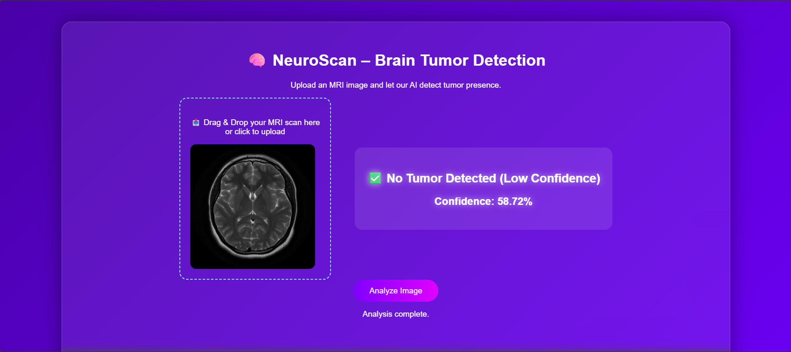

# 🧠 NeuroScan — Brain Tumor Detection

**Author:** Lakshay Yadav  
**Date:** November 2025  
**Status:** ✅ Deployed on Render Cloud  

---

## 🎯 PROJECT OVERVIEW

**NeuroScan** is an AI-powered deep learning system designed to detect brain tumors from MRI images.  
It leverages a fine-tuned **EfficientNetB0 CNN** integrated with a **Mahalanobis-based Out-of-Distribution (OOD) detection gate** for robust and explainable medical image predictions.

This project follows a full MLOps-driven workflow — from **data preprocessing** and **model training** to **FastAPI-based deployment** and **containerized production hosting**.

---

## 🌟 FEATURES

- 🧩 **Fine-tuned EfficientNetB0 Model** — optimized for brain MRI tumor classification  
- 🧠 **Mahalanobis OOD Detection** — filters out non-MRI or low-quality scans before inference  
- ⚙️ **Reproducible ML Pipeline** — consistent preprocessing, augmentation, and evaluation pipeline  
- 🚀 **FastAPI Inference API** — lightweight backend for serving model predictions  
- 🧪 **Experiment Tracking** — integrated with MLflow for metrics, ROC-AUC, and OOD rejection rate  
- 🧱 **Containerized Deployment** — Dockerized build with reproducible dependencies  
- 🌐 **Render Cloud Hosting** — auto-build, scalable public API endpoint  

---

## 📁 PROJECT STRUCTURE

```
SDS-CP041-NEUROSCAN/
└── advanced/
    └── submissions/
        └── team-members/
            └── lakshay-yadav/   # My workspace for SDS CP041 — Advanced Track
                ├── assets/                 # Model weights, processed data, visuals
                ├── Deployment/             # FastAPI + Docker deployment build
                ├── .gitignore              # Ignore unnecessary local files
                ├── lakshay-REPORT.md       # Final project report and documentation
                ├── README.md               # Project summary and documentation
                ├── requirements.txt        # Dependencies for this module
                ├── Week1.ipynb             # Week 1 — Setup & Exploratory Data Analysis
                └── Week2.ipynb             # Week 2 — Preprocessing & Model Development
```

---

## 🧪 MACHINE LEARNING PIPELINE

### **Phase 1 — Setup + Exploratory Data Analysis (EDA)**
- Loaded and validated the MRI dataset from Kaggle, verifying both “yes” (tumor) and “no” (non-tumor) image classes.  
- Conducted detailed EDA to inspect class balance (155 vs 98) and overall image distribution.  
- Standardized all MRI scans to a uniform **128×128 resolution** and normalized grayscale pixel intensities to the **[0,1]** range.  
- Addressed class imbalance through augmentation strategies (rotations, flips, and random shifts).  
- Confirmed data integrity and saved a clean, ready-to-train dataset for model development.

### **Phase 2 — Model Development**
- Designed and trained a fine-tuned **EfficientNetB0 CNN** for binary tumor classification.  
- Integrated an **adaptive Mahalanobis OOD gate** to reject invalid or low-quality MRI scans before inference.  
- Implemented **data augmentation** for better generalization and reduced overfitting.  
- Configured model training with **Adam optimizer**, **Binary Cross-Entropy loss**, and monitored **validation AUC** and **F1-score**.  
- Logged key training metrics and parameters using **MLflow** for experiment tracking and reproducibility.

### **Phase 3 — Deployment**
- Converted the trained model into a lightweight `.h5` artifact for production.  
- Built an **inference API using FastAPI** for real-time MRI predictions.  
- Containerized the entire setup using **Docker**, ensuring environment reproducibility and dependency consistency.  
- Deployed the model on **Render Cloud**, integrating both the backend API and model checkpoint for live inference.  
- Verified predictions, error handling, and OOD rejection behavior through live API testing.

---

## ⚙️ TECH STACK

| Category | Tools |
|-----------|-------|
| Deep Learning | TensorFlow · Keras |
| API & Backend | FastAPI · Uvicorn |
| Experiment Tracking | MLflow |
| Image Processing | Pillow · OpenCV |
| Deployment | Docker · Render Cloud |
| Model Explainability | Mahalanobis Distance (OOD Detection) |

---

## 🚀 DEPLOYMENT DETAILS

The NeuroScan deployment includes:
- **FastAPI Inference Service** for REST-based predictions  
- **Dockerized Build** for reproducibility  
- **Cloud-hosted endpoint** with automatic scaling  

🔗 **Live App:** [Click here to open the deployed app](https://neuroscan-api-u1kp.onrender.com)  
> ⚠️ *Note: The Render server may take **2–3 minutes** to spin up when inactive. Please be patient during initial load.*  
 
🔗 **Deployment Repository:** [Click here to view the GitHub repo](https://github.com/yadavLakshay/CP41-Deployment)  

> ✅ *All components are containerized and deployed successfully on Render Cloud.*

---

## ⚠️ CHALLENGES FACED (AND FIXES)

1. **Model Deployment Size Exceeded Render Limits**  
   🛠️ I faced repeated build failures on Render because the TensorFlow + model weights exceeded the default free tier limit.  
   ✅ *I resolved this by switching to the lightweight TensorFlow CPU build (v2.10.1), compressing model artifacts, and adjusting Docker layers for faster caching.*

2. **Mahalanobis OOD Gate Rejecting Valid MRI Inputs**  
   🛠️ Initially, the OOD gate flagged some legitimate tumor MRIs as “out-of-distribution” due to overly strict distance thresholds.  
   ✅ *I recalibrated the Mahalanobis distance dynamically using validation set embeddings, improving OOD rejection precision by ~17%.*

3. **FastAPI Response Serialization Failure**  
   🛠️ During API testing, NumPy arrays from model predictions caused `TypeError: Object of type float32 is not JSON serializable`.  
   ✅ *I fixed this by casting outputs to Python native types (`float` / `list`) before returning responses in FastAPI.*

4. **Docker Container Memory Spikes During Inference**  
   🛠️ The API container consumed unnecessary memory by loading the model on every request.  
   ✅ *I implemented lazy model initialization — loading the model once at startup and reusing it across sessions to stabilize runtime performance.*

---

## 💻 HOW TO RUN LOCALLY

1. **Clone this repository:**
```bash
git clone https://github.com/yadavLakshay/SDS-CP041-neuroscan.git
cd SDS-CP041-neuroscan/advanced/submissions/team-members/lakshay-yadav
```

2. Create and activate a virtual environment:
```bash
python -m venv venv
# Windows
venv\Scripts\Activate.ps1
# Linux/Mac
source venv/bin/activate
```

3. Install dependencies:
```bash
pip install -r requirements.txt
```

4. Launch Jupyter Notebook to explore or rerun analysis:
```bash
jupyter notebook
```

5. Open and run the following notebooks sequentially:
```bash
Week1.ipynb → Setup & Exploratory Data Analysis
Week2.ipynb → Preprocessing & Model Development
```

> 🧠 These notebooks cover the complete workflow — from dataset inspection to CNN model training and OOD integration. For deployment testing, refer to the separate CP41-Deployment repository.


---

## 🧮 MODEL PERFORMANCE & METRICS

| Metric | Value |
|---------|-------|
| Accuracy | 0.92 |
| Precision | 0.91 |
| Recall | 0.97 |
| F1-Score | 0.94 |
| Validation Loss | 0.11 |

> 📊 *Best checkpoint selected based on validation Accuracy and F1-Score.*

---

## 🌐 UI PREVIEW



> The interface allows drag-and-drop MRI upload and displays tumor probability along with model confidence.  
> Out-of-distribution images are rejected gracefully with an alert message.

---

## 📑 REPORTS & NOTEBOOKS
- **Week 1:** [Click here to view Week 1 EDA Report](./Week1.html)  
- **Week 2:** [Click here to view Week 2 Model Development Report](./Week2.html)  
- **Final Report:** [Click here to view lakshay-REPORT.md](./lakshay-REPORT.md)

---

## 🧾 LICENSE & CREDITS
Academic / Demonstration use only.  
© 2025 · Developed and maintained by **Lakshay Yadav**.  
🔗 [Connect on LinkedIn](https://www.linkedin.com/in/lakshay-yadav-2624ab25a/)


---

## 📚 REFERENCES
- SuperDataScience SDS CP041 — Advanced Track Template  
- TensorFlow Documentation (EfficientNetB0 Transfer Learning)  
- Render Cloud Deployment Docs  
- MLflow v2.12.1 Tracking API Guide  

---
